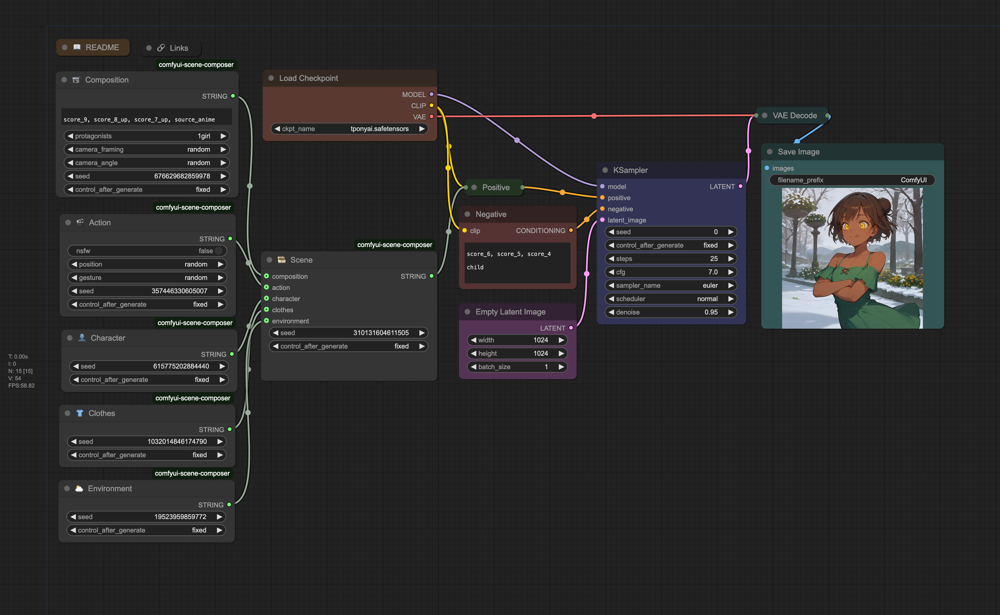

# ComfyUI Scene Composer
A collection of [ComfyUI](https://github.com/comfyanonymous/ComfyUI) nodes to create scenes with random procedural generation.



## Installation

### Via ComfyUI

If you have [ComfyUI Manager](https://github.com/ltdrdata/ComfyUI-Manager) installed, you can simply import [`workflow.json`](workflow.json) or [`workflow.png`](workflow.png) in ComfyUI and click on "Install Missing Nodes".

Alternatively, you can install it via the [Comfy Registry](https://registry.comfy.org/publishers/taches/nodes/comfyui-scene-composer) using the [CLI](https://docs.comfy.org/comfy-cli/getting-started#install-cli).

```shell
$ comfy node registry-install comfyui-scene-composer
```

### Manually

Clone this repo in `custom_nodes` situated in your ComfyUI install folder.

```shell
$ git clone https://github.com/taches/comfyui-scene-composer
$ pip install -r requirements.txt
```

## Usage

> [!NOTE]
> This is a basic guide to get you started. For more detailed information, please refer to the [wiki](https://github.com/mousse-taches/comfyui-scene-composer/wiki)

Add the `🎞️ Scene` node to your workflow. The output will be a prompt formatted as a string.
You can directly pass it to a conditioning node and connect it to your sampler.

The other nodes are scene components. You can use it as an optional input for the `🎞️ Scene` node, or directly as standalone.

| Component nodes | Description                                                   |
| --------------- | ------------------------------------------------------------- |
| 📹 Composition  | The layout of the scene, cameras, number of protagonists, etc |
| 🎬 Action       | Activities done by the character/protagonist(s)               |
| 👤 Character    | Main character, focusing on body type and faces, etc          |
| 👕 Clothes      | Include casual clothes, uniforms, swimsuits, underwear, etc   |
| ⛅️ Environment | The setting, including background, weather, time of day, etc  |

### Config files

You can customize the prompt generation for components by editing the corresponding TOML file in the `config` folder. Keep it mind that the config will be replace by the default when there's an update, so you might want to keep a backup.

## License

This project is licensed under the MIT License - see the [LICENSE](LICENSE) file for details.
